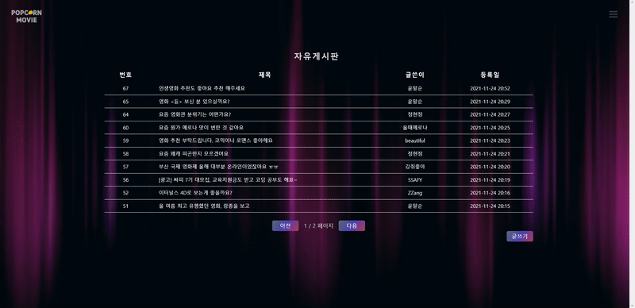

# 🍿 관통프로젝트 - POPCORN MOVIE


## 목차

[TOC]

## 배포 서버 URL

----- 배포 서버 생성 후 작성 -----


## 팀원 정보 및 업무 분담 내역

### 정현정(팀장)

- FRONT-END 담당


### 김영후

- BACK-END 담당


## 프로젝트 목표

- 영화 정보 기반 추천 서비스 구성
- 커뮤니티 서비스 구성
- 서비스 관리 및 유지보수


## 목표 서비스 구현

### 0. 개발 환경

- Python
  - Python
  - Django
- Javascript
  - Vue.js
- 사용 도구
  - VS Code
  - Chrome Browser
  - Notion
  - drow.io
  - Figma


### 1. POPCORN MOVIE의 MVP

> MVP란? Minimally Viable Product 즉, “최소 기능 제품”
>
> 제품이나 콘셉트의 가장 초기 단계 : 고객이 회사의 아이디어를 어떻게 받아들일지 평가하는 실험

#### 1. 누가 사용할 건가요?

- 무료 사이트이기 때문에 **전 연령대**가 사용할 것이라고 예상함 (유료 버전은 현재 계획에 없음)

- 정보 접근이 용이해진 21세기에 선택의 폭이 매우 넓어 어떤 일이건 결정하지 못하고 시간을 허비하는 사람들을 위함

- 영화를 좋아하는 사람들의 커뮤니티가 형성되어 수많은 영화 관련 정보를 얻을 수 있을 것이라 생각되어짐

- 페르소나

  

  - 아이들부터 어른까지 누구나 사용할 수 있는 플랫폼을 구축할 계획
  - 미성년자도 사용할 수 있기 때문에 adult 여부를 받아와서 첫 페이지(index.html)에는 성인만 볼 수 있는 영화일 경우 포스터가 보이지 않도록 만들기 등의 노력이 필요하다고 생각되어 짐.


#### 2. 어떻게 영화를 추천할 것인지?

- 랜덤 영화 추천 기능
- 인기(popularity)가 가장 높은 영화 순
- 평점(vote_average)이 가장 높은 순
- 최신 영화(release_date) 순


#### 3. 수익을 창출할 방법?

- 당장 PM 플랫폼은 무료 버전이기 때문에 수익이 없거나 적을 수 있음
- PM을 만드는 당사는 봉사활동을 하는 기업이 아니기 때문에 사이트의 규모가 커지면 수익을 취할 것
  - 다양한 광고 게재 (아무 광고나 올릴 시 사용자들의 불만이 높아질 수 있어 영화와 최대한 관련된 광고를 받을 수 있도록 노력 해야 할 것)
  - 유료 버전 만들기 (현재 넷플릭스, 왓챠, 티빙 등이 한국에서 많은 인기를 끌고 있는 가운데, 영화 추천 서비스인 PM이 추천 알고리즘을 점차 발전시켜 사용자가 원하는 영화 알고리즘만 만들도록 지속적으로 변화해나갈 것)
  - 커뮤니티에서 활성화된 다양한 영화 관련 정보를 통해 사업 영역을 확장 시켜나갈 계획
  - 등의 다양한 수익 창출 방법에 대해 앞으로도 고민을 해볼 것임


#### 4. 마케팅 전략

- 영화를 좋아하는 사람을 타켓팅 할 것이기 때문에 `영화관`이나 `부산 국제 영화제` 같은 영화를 좋아하는 사람들이 몰리는 곳에서 광고를 진행할 계획


### 2. POPCORN MOVIE의 목표 서비스


#### 1. INDEX 페이지

- NAVBAR는 다른 페이지로 이동해도 변화 없음
- 평점이 높은 추천 영화가 가장 상단에 나오도록 구현
- LOGIN버튼을 눌렀을 때 로그인 하는 창이 따로 나오고, 회원가입도 나오도록 구현 예정

- 다양한 영화 추천 기능이 메인 페이지에 나오도록 구현 예정
- 해당 유저의 프로필을 불러오도록 기능 구현 예정


#### 2. 단일 영화 DETAIL 페이지

- 한 영화를 클릭했을 때 해당 영화의 상세 정보를 출력할 예정
- 영화의 제목, 개봉 일자, 줄거리, 평점, 상영 시간, 장르 등을 출력
- PM을 사용하는 모든 유저들이 영화에 좋아요 버튼을 누를 수 있도록 구현

- 스크롤을 내리면 예고편을 볼 수 있도록 구현 예정(Youtube에 있는 해당 영화의 예고편을 출력)


#### 3. 사용자들이 작성할 게시판 COMMUNITY 페이지

- 게시글 번호, 작성자, 제목, 작성일로 나누어 화면에 출력

- COMMUNITY에 있는 게시글을 하나 들어갔을 때 제목, 작성자, 리뷰 내용, 작성 시간이 출력됨
- 리뷰를 본 다른 사람들이 댓글을 남길 수 있도록 만들어짐


#### 4. 유저 프로필 페이지

- 프로필을 클릭했을 때 볼 수 있는 화면(로그인이 되어있을 시에만 가능)
- 리뷰를 작성한 개수, 좋아요한 영화가 카운트되어 다른 사용자들도 볼 수 있음
- 좋아요를 누른 영화의 포스터를 보여줌


## 실제 구현

### 데이터베이스 모델링(ERD)


### 프로젝트 구조(FRONT)


### 프로젝트 구조(BACK)

```
┌── account
│   ├── migrations
│   ├── __init__.py
│   ├── admin.py
│   ├── apps.py
│   ├── models.py
│   ├── serializers.py
│   ├── tests.py
│   ├── urls.py
│   └── views.py
├── community
│   ├── migrations
│   ├── __init__.py
│   ├── admin.py
│   ├── apps.py
│   ├── models.py
│   ├── serializers.py
│   ├── tests.py
│   ├── urls.py
│   └── views.py
├── movies
│   ├── fixtures
│   |        ├── genres.json
│   |        └──    movies.json
│   ├── migrations
│   ├── __init__.py
│   ├── admin.py
│   ├── apps.py
│   ├── models.py
│   ├── serializers.py
│   ├── tests.py
│   ├── urls.py
│   └── views.py
├── tmdb
│   └── tmdb.py
├── server
│   ├── __init__.py
│   ├── asgi.py
│   ├── settings.py
│   ├── urls.py
│   └── wsgi.py
├── db.sqlite3
├── manage.py
├── README.md
└── requirements.txt
```


### 프로젝트 진행 방법

- 칸반 보드 : 칸반 보드를 이용하여 시작하지 않은 내역, 진행중인 내역, 완성된 내역 등을 나누어 한눈에 할 일을 파악하기 좋도록 사용


- 데일리 스크럼 밎 개발 일지 : 매일 아침 9시, 오후 5시 하루 2번씩 데일리 스크럼으로 오늘 어떤 일을 했는지, 앞으로는 어떤 일을 할건지 공유하여 서로가 무엇을 하고 있는지, 남은 기간을 활용하여 얼마나 더 개발을 할 것인지 꾸준히 소통하여 프로젝트를 진행


### UI / UX

#### 메인 페이지


- 영화 추천 기능으로 랜덤 영화 추천/인기 콘텐츠/평점이 높은 순/최근에 개봉한 영화, 총 4가지 추천을 받을 수 있음
- 로그인 된 회원은 마음에 드는 영화를 `좋아요(하트)` 눌러놓은 후 프로필 페이지에서 확인 가능
- `상세 정보` 버튼을 누르면 해당 영화의 상세 정보를 확인할 수 있음
- 깔끔하고 심플한 페이지를 구성하기 위해 Navbar는 사이드 슬라이더를 이용하여 구현되었음


#### 게시판



- 영화에 대한 이야기를 나눌 수 있는 게시판
- 글의 제목을 누르면 해당 글의 상세 페이지로 들어갈 수 있음
- 게시글은 해당 게시글을 작성한 사용자만 수정 혹은 삭제를 할 수 있도록 구현


##### 상세 게시글

- 상단에 제목, 글쓴이, 작성일자를 올리고 `hr`기능을 활용해 내용과 분리된 느낌을 받을 수 있도록 디자인
- 댓글 목록은 게시글 하단에 위치해있고, 어떤 유저가 어떤 댓글을 달았는지 확인할 수 있음
- 게시글과 마찬가지로 댓글도 작성한 사용자에게만 삭제 버튼을 보이게 구현


#### 검색


- TMDB 사이트의 API를 이용하여 구현되었기 때문에 업데이트가 필요 없음
- 검색 결과에 나온 영화의 포스터를 클릭하면 해당 영화의 상세 페이지로 들어갈 수 있음
- 포스터, 제목, 개봉일, 상영 시간, 장르, 줄거리는 물론이고 Youtube API를 이용하여 영화 예고편도 볼 수 있음


#### 프로필


- 사용자의 관심 영화 목록과 작성한 게시글을 볼 수 있음
- 작성한 게시글 중 하나를 누르면 해당 게시글의 상세 페이지로 이동 가능


#### 로그인 / 회원가입


- 빈 값이 있을 때 오류 알림을 주어 로그인/회원가입이 되지 않도록 구현


## 느낀점

### 정현정

웹사이트를 만드는 것 자체가 쉽지 않을 것이라고 생각은 했었지만 이렇게까지 힘들 줄은 꿈에도 몰랐다😂 딱 1주일 Vue를 배우고 3주 배운 장고와 연결한다는 것 자체가 사실 쉽지 않은 일이었는데 호기롭게 Front를 하겠다고 자처한 나, 하는 도중에는 너무 힘들고 지쳐서 도망치고 싶은 마음이 간절했지만 배웠던 내용을 다시 복습하고 구글링하면서 많은 것을 배운 것 같다. (특히 Vue) 

팀원이었던 영후님이 너무 잘해주셔서 멋진 결과물이 나온 것 같고 정말 감사하게 생각한다. 정말 잘해주셔서 많은 것을 배울 수 있었던 프로젝트였던 것 같다!

우리 팀은 Django, Vue를 이용해 기술을 먼저 구현한 후 CSS를 이용해 화면을 디자인했는데, 처음 CSS를 배우게 되었을 때 교수님께서 보여주셨던 'CSS IS AWESOME' 글이 생각났다. 정말 Awesome한 CSS... 분명 아까까지는 잘 되던게 갑자기 이리 저리 옮겨져 있는 모습을 보고 화가 나기도 했다...! 하지만 프론트는 여전히 재미있다! 열심히 공부한다고 했지만 아직도 모자라다는 것이 느껴졌고, 2학기에 가서도 프로젝트를 계속 할텐데 더 열심히 해서 실력을 키워나가도록 노력해야겠다!


### 김영후

개발자로의 진로를 정한 후, 첫 팀플 프로젝트를 완성하였다. 내가 생각했던 것 만큼 되지는 않았지만 그래도 괜찮은 결과물이라고 생각한다. 주제는 '영화 추천'으로 정해졌고, 나는 넷플릭스나 왓챠 같은 영화나 드라마 스트리밍을 즐겨보기 때문에 이러한 사이트를 유사하게 만들고자 생각했다. 

개발환경은 Django와 Vue를 사용했는데, 최종 프로젝트를 하기전에는 오직 Django로, 혹은 Vue로만 사이트를 만들었기 때문에 이번 프로젝트가 지금까지 했던 모든 프로젝트를 관통하여 종합하기 때문에 마음을 단단히 먹고, 2~3일 밤 정도는 샐 각오를 하고 프로젝트에 임했다. 실제로 3일동안 밤을 샜었고, 프로젝트 중간에는 시험까지 겹치는 바람에 프로젝트 기간의 절반은 프로젝트에 올인을 할 수가 없었다.

나는 항상 Simple is Best를 추구하기 때문에 팀플 페어가 된 현정님에게 사이트를 단순하게 만들자고 했고, 알았다면서 같이 프로젝트를 시작했다. 서버 부분은 단순하기 때문에 쉽게 만들 수 있었다. 이제, TMDB에서 영화 데이터를 가져와야하는데 이 것이 프로젝트 진행에서 첫 번째 고비였고, 구글링으로 참고하면서 데이터를 가져왔다.

이제 Vue를 통해서 영화 데이터를 보여주고, 게시판도 만들고, 프로필 페이지, 로그인/회원가입, 검색창 이 5가지 기능만 구현하면 되는 것이기에 생각보다 수월하게 진행될 줄 알았으나 router를 왜 써야하는지 모르고, 기존 prop 방식이 편한 점 이런 것을 다 까먹은 채 생각 없이 하다가 error 파티를 열게되었다. 꾸준히 복습을 했는데도 왜 머리가 백지가 됐는지 이해가 안가지만, 개발자는 구글링을 달고 살아야하기 때문에 구글링을 통해 기능 구현을 쉽게할 수 있었다. 

문제는 raw한 사이트에 스타일링은 하는 것인데, 이전에 html css로 사이트 구현할 때 엄청 스트레스를 받은 부분이어서 프론트엔드 분야는 웬만하면 피하고 싶었지만, 피하면 안되기 때문에 밤새가면서 꾸미고 디자인을 했다. 추가적인 모듈로 Vue-slide, Vue Modal, Vue-menu, Vue-pagination 등을 사용하면서 사이트에 날개를 달아줬다. 이 중에서 Modal이 이번 프로젝트에서 가장 큰 고비였고, 결국 90% 정도로만 완성했다. css에서 position 잡고, container 부분을 조작하는 것이 아직까지도 익숙하지가 않다. 그래도 이번 프로젝트에서 가장 큰 것을 얻은 것이 있다하면 개발자 도구를 활용한 것이라고 말할 수 있다. 개발자 도구로 css 부분을 조작하고 부모 태그와 자식 태그의 관계에서 어떻게 조작해야하는지, 참조되어있는 부분을 계속 보다보니까 css 부분도 완성할 수 있었다.

사이트를 완성하고 돌아보니 로딩이 너무 오래걸리는 것이 흠이었다. 그래서 검색창 부분은 TMDB 실시간 통신으로 데이터를 불러오는 방법으로 구현을 했는데, 진작에 영화 데이터도 이런 방법을 썼으면 어땠을까라고 생각을 했다. 데드라인은 생명이기 때문에 다시 구현을 하다가는 하이리스크가 발생할 것만 같아서 그냥 놔두고, 디자인을 좀 더 관찰을 했다. 

디자인을 다하고 나서 보니, 사이트가 너무 심심해 보였다. 아니, 단순한 사이트를 만들고자 계획을 세웠는데 왜 초심을 잃었는지.. 참;  그래서 'vs대전'을 구현하고자 6시간 동안 구상하고 다시 모델링하고 했는데, 영화 포스터 이미지가 노출되지 않는다. 이건 구글링으로도 해결을 못해서 그냥 포기했다. 데드라인 이 후 개인적으로 꼭 구현하고 싶은 부분이다.

프로젝트를 완성하고 돌아보니, 이렇게 간단한 사이트를 만드는데도 쉽지 않다는 것을 느꼈고, 왜 개발자는 평생 공부를 해야하는지 제대로 느꼈다. 결국 개발은 트렌드가 생명이기 때문. 개발 공부를 시작한지 4개월이 지났다. 4개월 동안 쌓은 역량을 프로젝트 기간 동안 모든 것을 올인했기 떄문에 후회는 없었고, 이 정도면 잘한 것이라고 생각하고, 다음 프로젝트는 더 발전해서 완성하고 싶다.


